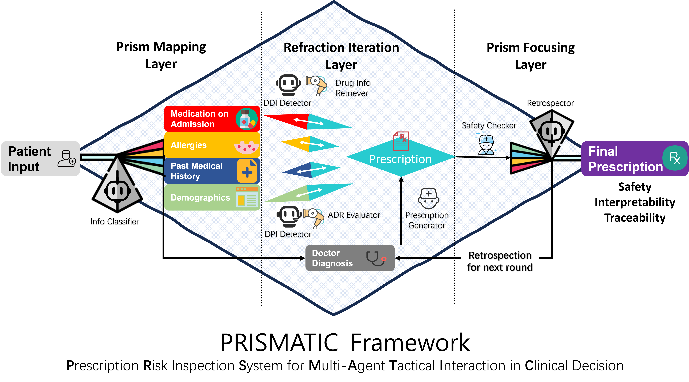

# PRISMATIC: ***P***rescription ***R***isk ***I***nspection ***S***ystem for ***M***ulti-***A***gent ***T***actical ***I***nteraction in ***C***linical Decision

### A multi-agent architecture leveraging patient statements and clinical knowledge for prescription risk inspection. 

- <b>Prism Mapping Layer</b> for information extraction and classification from patient input.
- <b>Refraction Iteration Layer</b> where multiple agents (e.g., DDI Detector, DPI Detector) collaboratively refine a prescription based on extracted information and clinical rules.
- <b>Prism Focusing Layer</b> for final safety checks and interpretability analysis. 
- <b>Retrospection mechanism</b> enables continuous learning and improvement of the system.