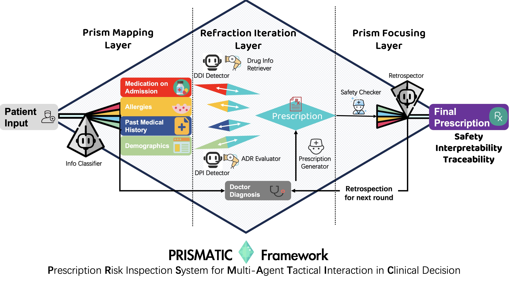

# PRISMATIC: ***P***rescription ***R***isk ***I***nspection ***S***ystem for ***M***ulti-***A***gent ***T***actical ***I***nteraction in ***C***linical Decision



## A multi-agent architecture leveraging patient statements and clinical knowledge for prescription risk inspection. 

Medication prescribing errors remain a critical challenge in clinical practice, often stemming from incomplete patient understanding, ambiguous documentation, and suboptimal decision support. 
In this paper, we propose PRISMATIC, a 3-layer multi-agent prescription risk mitigation framework designed to generate safe, interpretable, and traceable drug regimens by analyzing unstructured patient clinical note texts.
To enhance adaptability and safety, PRISMATIC integrates two mechanisms: (1) Dynamic Self-updating Weight Adjustment (DSWA), which tunes risk factor weights over time, and (2) Differential Feedback Calibration Mechanism (DFCM), which learns from discrepancies with gold-standard prescriptions to improve future outputs.
Evaluated on a curated dataset from MIMIC-IV, PRISMATIC outperforms raw LLM outputs and prompting-based baselines (Few-Shot, Chain-of-Thought, ReAct, Tree-of-Thoughts) in reducing prescription risks. These results highlight the potential of multi-agent systems for improving clinical medication decision support.

## Setup Instructions

This project uses [Poetry](https://python-poetry.org/) to manage dependencies and the virtual environment.

### 1. Install Poetry

You can install Poetry via `pip`:

```bash
pip install poetry
```
Or using the official installer (recommended):
```bash
curl -sSL https://install.python-poetry.org | python3 -
```

### 2. Install Dependencies
Clone & Navigate to the project directory and run:
```bash
git clone https://github.com/ZaneLing/PharmAid.git
cd PharmAid
poetry install
```
This will install all required packages and set up a virtual environment.

### 3. Set OpenAI API Key
Please specify your `OPENAI_API_KEY` at the first line in the `workflow.sh`
```bash
export OPENAI_API_KEY = 'your_api_key'
```
### 4. Run the Workflow
To execute the main script within the Poetry environment, simply run the bash script:
```bash
./workflow.sh
```